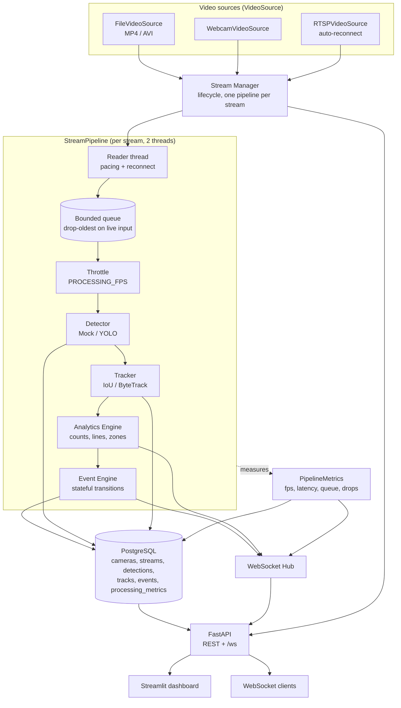
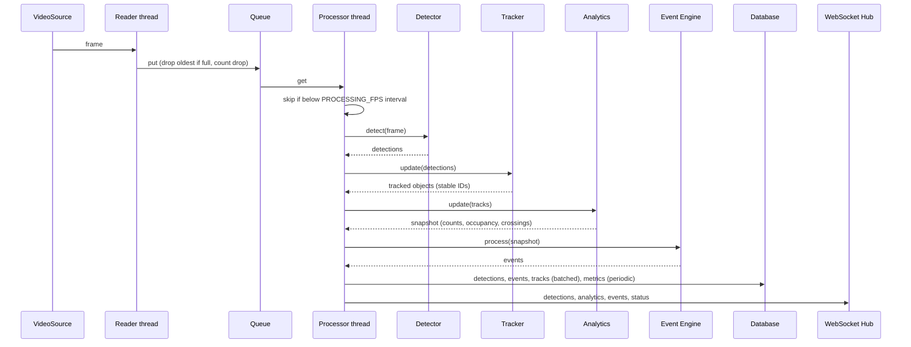
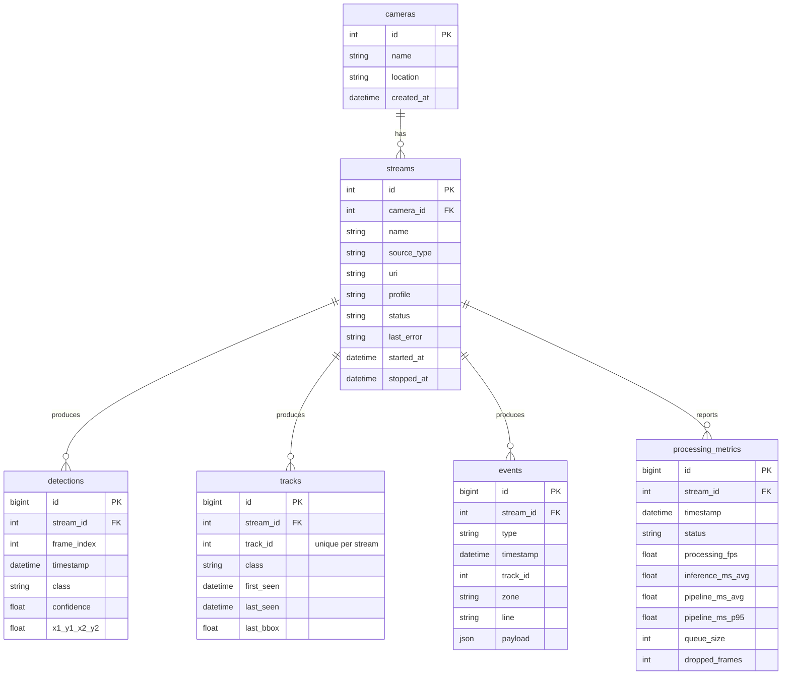

# Architecture

## System overview

```mermaid
flowchart TD
    subgraph Sources["Video sources (VideoSource)"]
        F[FileVideoSource<br/>MP4 / AVI]
        W[WebcamVideoSource]
        R[RTSPVideoSource<br/>auto-reconnect]
    end

    SM[Stream Manager<br/>lifecycle, one pipeline per stream]
    F --> SM
    W --> SM
    R --> SM

    subgraph Pipeline["StreamPipeline (per stream, 2 threads)"]
        RD[Reader thread<br/>pacing + reconnect]
        Q[(Bounded queue<br/>drop-oldest on live input)]
        TH[Throttle<br/>PROCESSING_FPS]
        DET[Detector<br/>Mock / YOLO]
        TRK[Tracker<br/>IoU / ByteTrack]
        AN[Analytics Engine<br/>counts, lines, zones]
        EV[Event Engine<br/>stateful transitions]
        RD --> Q --> TH --> DET --> TRK --> AN --> EV
    end
    SM --> RD

    MET[PipelineMetrics<br/>fps, latency, queue, drops]
    Pipeline -. measures .-> MET

    DB[(PostgreSQL<br/>cameras, streams, detections,<br/>tracks, events, processing_metrics)]
    HUB[WebSocket Hub]
    EV --> DB
    DET --> DB
    TRK --> DB
    MET --> DB
    EV --> HUB
    AN --> HUB
    MET --> HUB

    API[FastAPI<br/>REST + /ws]
    DB --> API
    HUB --> API
    SM --> API
    API --> DASH[Streamlit dashboard]
    API --> WSC[WebSocket clients]
```

## Per-frame sequence

```mermaid
sequenceDiagram
    participant S as VideoSource
    participant R as Reader thread
    participant Q as Queue
    participant P as Processor thread
    participant D as Detector
    participant T as Tracker
    participant A as Analytics
    participant E as Event Engine
    participant DB as Database
    participant H as WebSocket Hub

    S->>R: frame
    R->>Q: put (drop oldest if full, count drop)
    Q->>P: get
    P->>P: skip if below PROCESSING_FPS interval
    P->>D: detect(frame)
    D-->>P: detections
    P->>T: update(detections)
    T-->>P: tracked objects (stable IDs)
    P->>A: update(tracks)
    A-->>P: snapshot (counts, occupancy, crossings)
    P->>E: process(snapshot)
    E-->>P: events
    P->>DB: detections, events, tracks (batched), metrics (periodic)
    P->>H: detections, analytics, events, status
```

## Database schema

```mermaid
erDiagram
    cameras ||--o{ streams : has
    streams ||--o{ detections : produces
    streams ||--o{ tracks : produces
    streams ||--o{ events : produces
    streams ||--o{ processing_metrics : reports

    cameras { int id PK
        string name
        string location
        datetime created_at }
    streams { int id PK
        int camera_id FK
        string name
        string source_type
        string uri
        string profile
        string status
        string last_error
        datetime started_at
        datetime stopped_at }
    detections { bigint id PK
        int stream_id FK
        int frame_index
        datetime timestamp
        string class
        float confidence
        float x1_y1_x2_y2 }
    tracks { bigint id PK
        int stream_id FK
        int track_id "unique per stream"
        string class
        datetime first_seen
        datetime last_seen
        float last_bbox }
    events { bigint id PK
        int stream_id FK
        string type
        datetime timestamp
        int track_id
        string zone
        string line
        json payload }
    processing_metrics { bigint id PK
        int stream_id FK
        datetime timestamp
        string status
        float processing_fps
        float inference_ms_avg
        float pipeline_ms_avg
        float pipeline_ms_p95
        int queue_size
        int dropped_frames }
```
